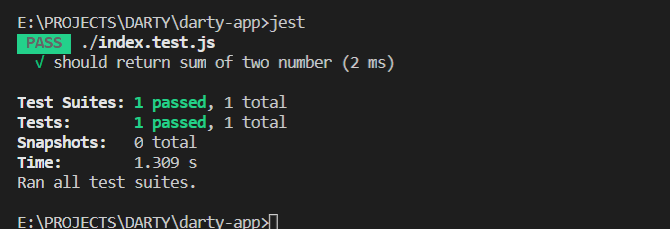

# App Naïf 

Nous avons ici un projet qui ne fait rien d'exceptionnel, rien de nouveau sous le soleil. 


### Ce que je dois impérativement avoir pour commencer

- Installation de NPM  https://nodejs.org/en/download/

- Installation de GIT  https://git-scm.com/downloads

- Installation de mes IDEs préférés: 

  - VS CODE https://code.visualstudio.com/download

  - NotePad++ https://notepad-plus-plus.org/downloads/


### Installation de mon outil de test 

```bash
npm i jest-cli -g
```

####  Il faut prendre le projet dans le dépôt Github

```
git clone https://github.com/nsimonin1/veille-team-app.git
```

Ouvrir dans VS Code

```bash
cd veille-team-app
code . 
```

## Usage

### Ma première fois dans VS Code 

1. Ouvrir le terminal 

> Menu ==> Terminal ==> New Terminal (Ctrl+Shift+ù)

2. Saisir la commande 

```bash
npm install
```

3. Exécuter le test unitaire 

```bash
jest 
```

4. ou si vous voulez exécuter le test unitaire d'un seul fichier 

```bash
jest ./index.test.js
```

et voilà!




#### Envoyer vos modifications pour que vos camarades utilisent n'a rien de méchant

```bash
git add .
git commit -m "un message assez mignon"
git push 
```

